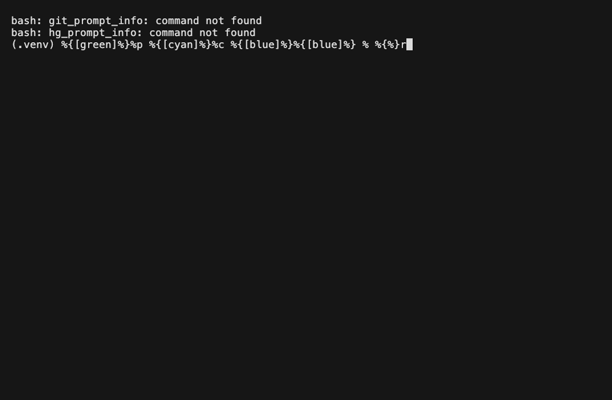
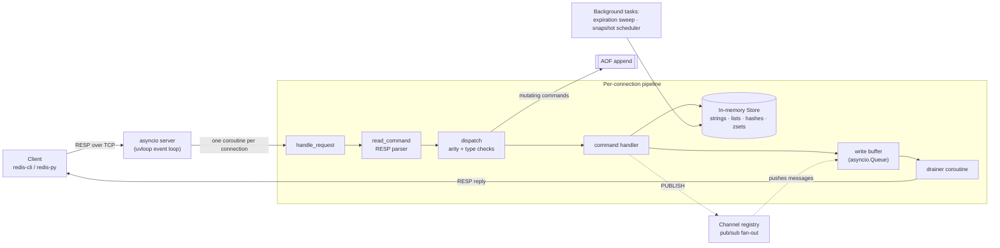
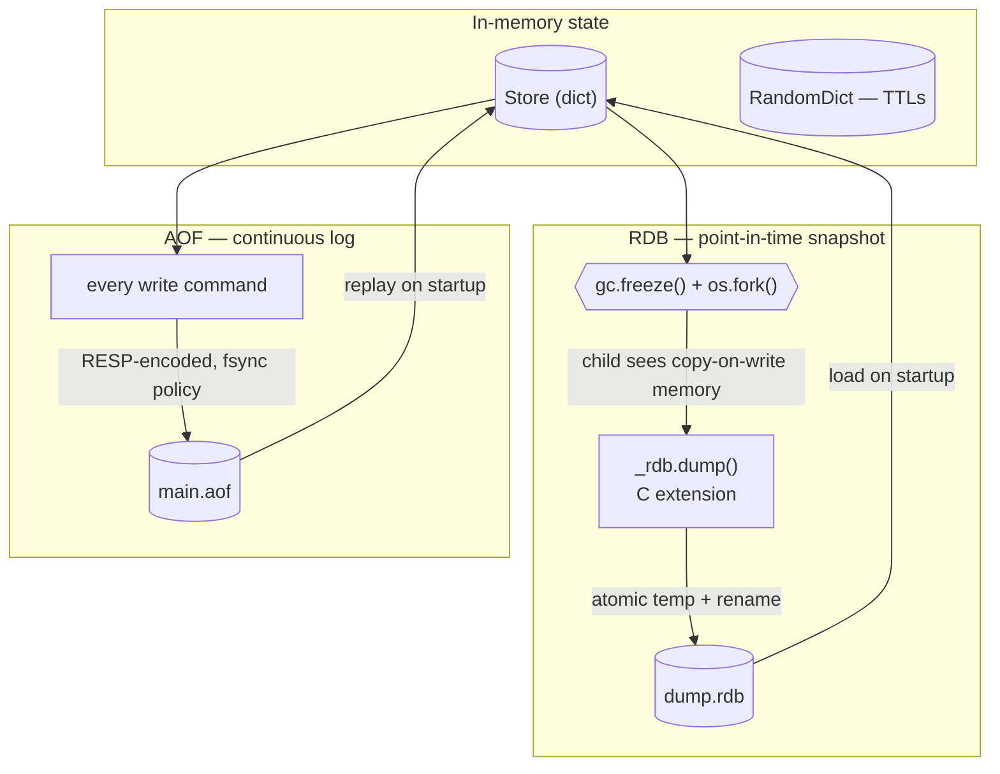
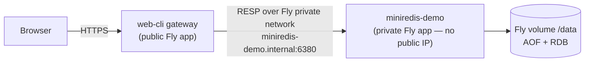

# miniredis

**A Redis-compatible in-memory database, written from scratch in Python.**

miniredis speaks the real [RESP-2](https://redis.io/docs/latest/develop/reference/protocol-spec/) wire protocol, so any unmodified Redis client — `redis-cli`, `redis-py`, your app's existing Redis library — connects and talks to it as if it were Redis itself. Under the hood it implements four data types on custom data structures, two persistence engines (point-in-time snapshots **and** an append-only log), transactions, pub/sub, and a C extension for the snapshot encoder.

<p align="left">
  
  
  
  
  
</p>

> **Try it live (no install):** **[open the browser demo →](https://miniredis-web-cli.fly.dev/)**
> A hosted terminal that talks to a live miniredis instance. Type `PING`, `SET`, `SUBSCRIBE`, `MULTI` — it's the real server.

<!-- Replace docs/demo.gif with your recording (instructions at the bottom of this file). -->


---

## Why this project

I set out to answer a question I couldn't answer confidently from just using Redis: *how does a production in-memory database actually work underneath?* So I rebuilt one — not a toy key-value dict behind a socket, but the parts that make Redis Redis: the wire protocol, the data structures behind sorted sets, the fork-based snapshot trick, crash-safe durability, and the concurrency model. Each of the design decisions below involved real trade-offs, which I've written up alongside the choice.

It is wire-compatible: point `redis-cli -p 6380` at it and it just works.

```console
$ redis-cli -p 6380
127.0.0.1:6380> SET greeting "hello from miniredis"
OK
127.0.0.1:6380> ZADD leaderboard 100 alice 250 bob 175 carol
(integer) 3
127.0.0.1:6380> ZRANGE leaderboard 0 -1
1) "alice"
2) "carol"
3) "bob"
127.0.0.1:6380> MULTI
OK
127.0.0.1:6380(TX)> INCR counter
QUEUED
127.0.0.1:6380(TX)> EXEC
1) (integer) 1
```

---

## Highlights

- **Real RESP-2 protocol** — binary-safe, length-prefixed framing, hand-written parser and encoder. Interoperates with any Redis client library.
- **4 data types on purpose-built structures** — strings, lists, hashes, and **sorted sets backed by a hand-implemented skip list** with span-augmented `O(log n)` rank queries.
- **Two persistence engines**
  - **RDB snapshots** via `fork()` + copy-on-write + `gc.freeze()`, with the binary encoder written as a **CPython C extension**.
  - **AOF (append-only file)** with configurable `fsync` policies, startup replay, **crash-safe tail-truncation recovery**, and transactions logged atomically.
- **Transactions** — `MULTI` / `EXEC` / `DISCARD` with correct queue-time vs. runtime error semantics (`EXECABORT`).
- **Pub/Sub** — channels and glob-pattern subscriptions, with a Redis-faithful pattern matcher written from scratch (not `fnmatch`).
- **Single-threaded async core** on `asyncio` + **`uvloop`**, with a per-connection write queue to avoid head-of-line blocking.
- **Active + passive key expiration**, mirroring Redis's sampling sweeper plus lazy-on-access eviction.
- **470 tests** — unit, property-based (`hypothesis`), and end-to-end against the real `redis-py` client.
- **Production-shaped ops** — 12-factor config (`pydantic-settings`), structured logging (`structlog`), a multi-stage **Dockerfile**, and a **Fly.io** deployment.

---

## Quickstart

**Requirements:** Python 3.13+, a C compiler (for the `_rdb` extension), and [`uv`](https://github.com/astral-sh/uv).

```bash
git clone https://github.com/rhythemAgrawal/miniredis.git
cd miniredis
uv sync                       # resolves deps and compiles the C extension
uv run python -m miniredis    # starts the server on 127.0.0.1:6380
```

In another terminal:

```bash
redis-cli -p 6380 ping        # -> PONG
```

Run the test suite:

```bash
uv run pytest                 # 470 tests
```

Or run it in Docker:

```bash
docker build -t miniredis .
docker run -p 6380:6380 -v miniredis-data:/data miniredis
```

---

## Supported commands

43 commands across the four data types plus transactions, pub/sub, and connection management.

| Group | Commands |
| --- | --- |
| **Connection** | `PING` `ECHO` |
| **Strings & counters** | `GET` `SET` (with `EX`/`PX`/`PXAT`) `APPEND` `STRLEN` `INCR` `DECR` `INCRBY` `DECRBY` |
| **Keys & TTL** | `DEL` `EXISTS` `EXPIRE` `PEXPIREAT` `TTL` `PERSIST` |
| **Lists** | `LPUSH` `RPUSH` `LPOP` `RPOP` `LRANGE` `LLEN` |
| **Hashes** | `HSET` `HGET` `HDEL` `HGETALL` `HKEYS` `HVALS` `HLEN` |
| **Sorted sets** | `ZADD` `ZSCORE` `ZRANK` `ZRANGE` `ZRANGEBYSCORE` `ZREM` |
| **Transactions** | `MULTI` `EXEC` `DISCARD` |
| **Pub/Sub** | `SUBSCRIBE` `PSUBSCRIBE` `UNSUBSCRIBE` `PUNSUBSCRIBE` `PUBLISH` |

---

## Architecture

### Connection lifecycle

Each client connection is served by one coroutine on a single-threaded event loop. Reads are parsed into commands, dispatched to handlers that mutate one shared in-memory store, and replies are pushed onto a per-connection queue drained by a dedicated writer coroutine — so a slow client can never block command processing for others.



### Persistence

Two independent, complementary durability engines — the same model Redis uses.



---

## Key design decisions

**Sorted sets on a hand-built skip list.**
`ZRANGE`/`ZRANK` need ordered iteration *and* `O(log n)` rank lookups. A skip list gives both, and I augmented each forward pointer with a **span** (how many nodes it skips) so rank queries are `O(log n)` instead of a linear walk. The sorted set is a skip list for ordering paired with a dict for `O(1)` score lookups — exactly Redis's `zset` design.

**Key expiration: active sampling + passive eviction, on a custom `RandomDict`.**
A key with a TTL can expire while no client ever touches it again, so lazy deletion alone would slowly leak memory. miniredis mirrors Redis's two-pronged approach: an expired key is evicted lazily the moment it's next accessed (passive), and a background sweeper periodically samples random TTL-bearing keys and clears the expired ones (active). That sampling has to pull *random* keys in `O(1)` — which a plain dict can't do — so TTLs live in a custom `RandomDict` that keeps a parallel list plus a position index for `O(1)` random selection, the same structure Redis's expiry cycle samples from.

**Snapshots via `fork()` + copy-on-write, not by pausing writes.**
Naively, snapshotting means "stop accepting writes, serialize everything, resume" — a latency spike no one should ship. Instead `snapshot()` calls `os.fork()`: the child inherits a copy-on-write view of memory and serializes it while the parent keeps serving. `gc.freeze()` is called first so CPython's reference-counting garbage collector doesn't dirty (and thus force a copy of) otherwise-untouched memory pages in the child. The parent reaps the child asynchronously via a non-blocking `waitpid` poll with a timeout-and-`SIGKILL` fallback.

**A C extension for the RDB encoder.**
The snapshot's binary format is a tight byte-packing loop — the kind of thing Python is slowest at. I wrote it as a CPython C extension (`_rdb.c`) that walks the dict with borrowed references (so it doesn't bump refcounts and dirty CoW pages in the forked child), writes to a `.tmp` file, `fsync`s with the GIL released, and atomically renames into place.

**AOF that's actually crash-safe.**
Every mutating command is appended to a log and replayed on startup. Two details make it correct rather than merely present:
- **Transactions are logged as a `MULTI … EXEC` envelope**, so a crash mid-write can never replay a *partial* transaction — replay either applies all of it or discards the torn tail.
- **Startup distinguishes a torn tail from mid-file corruption.** A half-written final command (from a `kill -9` between write and `fsync`) is truncated and the server starts; corruption *in the middle* of the file is fatal and refuses to start — matching Redis's `aof-load-truncated` behavior.

TTL commands are rewritten to absolute timestamps (`EXPIRE` → `PEXPIREAT`) before logging, so replaying an hour later doesn't hand a key a fresh, wrong lifetime.

**Per-connection write queue.**
Replies aren't written to the socket inline. Each handler pushes bytes onto an `asyncio.Queue`; a dedicated drainer coroutine writes them and awaits back-pressure. This keeps one slow or stalled client from blocking the event loop for everyone — and it's what lets pub/sub fan a message out to many subscribers without any of them blocking the others.

**A hand-written glob matcher for pub/sub patterns.**
`PSUBSCRIBE news.*` uses Redis's glob rules (`*`, `?`, `[...]` classes with `^` negation and ranges, `\` escapes) — which differ from Python's `fnmatch` in five specific ways. Rather than ship a subtly-wrong port, I read Redis's `stringmatchlen` and implemented the matcher to match it.

---

## Benchmarks

Measured with `redis-benchmark` against both miniredis and a real `redis-server` **on the same machine**, with **persistence disabled on both sides** for a fair, apples-to-apples comparison (see [Methodology](#methodology--honesty)).

### Throughput (operations / second)

**Without pipelining (`-P 1`)** — one command per network round-trip:

| Command | miniredis | Redis | ratio |
| --- | ---: | ---: | ---: |
| SET   |  84,353 | 169,492 | 50% |
| GET   | 104,712 | 182,983 | 57% |
| LPUSH |  83,403 | 171,086 | 49% |
| LPOP  |  91,199 | 178,731 | 51% |
| HSET  |  74,850 | 171,674 | 44% |
| **avg** | **~87,700** | **~174,800** | **~50%** |

**With pipelining (`-P 16`)** — 16 commands per round-trip:

| Command | miniredis | Redis | ratio |
| --- | ---: | ---: | ---: |
| SET   | 152,207 | 1,915,709 | 7.9% |
| GET   | 214,270 | 2,272,727 | 9.4% |
| LPUSH | 145,243 | 1,876,173 | 7.7% |
| LPOP  | 168,039 | 1,801,802 | 9.3% |
| HSET  | 119,161 | 1,937,985 | 6.2% |
| **avg** | **~159,800** | **~1,960,900** | **~8%** |

Switching the event loop from stock `asyncio` to **`uvloop` added 17–22%** across the board.

### Why the ratio swings from ~50% to ~8%

This is the interesting part, and it precisely locates the gap. Split each command's wall-clock time into two pieces:

- **`T_rt`** — the per-round-trip cost: syscalls, the kernel moving bytes over the loopback interface, the event loop waking up. Measured at **~5.5 µs, and it's essentially identical for both servers** — it's OS work, not application work.
- **`T_proc`** — the actual command processing. **Redis ≈ 0.16 µs. miniredis ≈ 5.9 µs** — about **37× slower per command**.

At `-P 1`, every command pays the full `T_rt`, so that shared ~5.5 µs dominates both servers and the ratio looks *close* (~50%). At `-P 16`, `T_rt` is amortized across 16 commands (~0.34 µs each), so what's left is almost pure `T_proc` — and that's where Python's 37× processing tax is fully exposed (~8%).

So the two numbers together are a diagnosis: **the gap is per-command CPU work, not network or I/O handling** (which is competitive).

### Where miniredis's 5.9 µs actually goes

I profiled and micro-benchmarked the per-command path. The single largest component is **reading and parsing the request off the socket: ~3.43 µs**, and I decomposed it (5 trials, negligible variance):

| Component of the read path | µs/cmd | what it is |
| --- | ---: | --- |
| general-purpose `StreamReader` method calls + read loop | **~2.54** | asyncio parses a command as ~10 separate `readuntil`/`readexactly` calls (one per RESP field), each a full method call running generic, branch-heavy logic and allocating throwaway objects |
| irreducible parsing work | 0.52 | the actual "find the delimiter, read the length, slice the bytes" — unavoidable |
| coroutine machinery (10 `await`s) | 0.37 | creating/driving/finishing the coroutine per `await` |
| **total** | **~3.43** | |

The reasons miniredis is slower than Redis, most to least impactful, with numbers where I could isolate them:

1. **Interpreted vs. compiled (pervasive).** CPython runs bytecode through an interpreter loop; Redis is compiled C running directly on the CPU. Every operation carries this tax — it's the multiplier under everything below and can't be isolated into one line item.
2. **The async read path — ~3.43 µs, the biggest single cost.** miniredis reads through asyncio's `StreamReader`, a *general-purpose* stream API that parses each command as ~10 independent, suspendable method calls, each re-running checks a length-prefixed protocol never needs and allocating two short-lived objects. A purpose-built parser does the identical work in **one pass over one buffer at 0.52 µs**.
3. **Everything is a heap object.** Each parsed command allocates ~a dozen reference-counted `bytes`/`int`/`list` objects; Redis works with packed structs and pooled/shared objects.
4. **No zero-copy response encoding.** Each reply builds fresh `bytes`; Redis writes into a preallocated per-client output buffer.

### The known ~1.7× win (on the roadmap)

Reason #2 is the actionable one, and it needs **no C extension**. Replacing `StreamReader` with a hand-rolled streaming RESP parser — a `recv`-fed `bytearray` buffer, an integer cursor (bytes never move), and a small state machine that resumes across packet boundaries — would reclaim **~2.5 µs of the ~5.9 µs per command**, dropping per-command processing to **~3.4 µs (~1.7× throughput at `-P 16`)**, in pure Python. The design is fully worked out and is the next item in the [roadmap](#roadmap).

### Methodology & honesty

- **Hardware:** single machine, loopback; `redis-benchmark` from the same Redis install driving both servers.
- **Fairness:** persistence disabled on both (`FSYNC_POLICY=NO` for miniredis, `--save ""` and no AOF for Redis), so neither pays a durability cost the other doesn't.
- **Scope:** these are single-node, single-client micro-benchmarks of raw command throughput — not a claim about clustering, concurrency at scale, or tail latency under contention.
- **On the numbers above:** I arrived at them by measuring, and I discarded two of my own initial hypotheses when the data contradicted them — I first suspected buffer-shuffling (`del buffer[:n]`) and coroutine object churn were the culprits; direct measurement showed the front-delete is `O(1)` (~22 ns, flat regardless of buffer size) and the coroutine machinery is only 0.37 µs (~13%). The real cost is the ten general-purpose method calls. The figures reported here are the corrected, verified ones.

---

## Testing

470 tests, run with `uv run pytest`:

- **Unit** — RESP encode/decode, every command handler, the store, the skip list, the C extension.
- **Property-based** (`hypothesis`) — protocol round-trips and skip-list invariants against generated inputs.
- **End-to-end** — a real `redis-py` client driving a live server subprocess, proving true wire compatibility (including transactions and pub/sub).
- **Persistence** — snapshot round-trips per data type, AOF replay, the `MULTI`/`EXEC` crash-atomicity path, torn-tail truncation, and mid-file-corruption rejection.

| Suite | Focus |
| --- | --- |
| `test_protocol.py` | RESP parser + encoders |
| `test_custom_data_structures.py`, `test_skiplist.py` | RandomDict, SortedSet, skip list |
| `test_store.py`, `test_commands.py` | store internals + every command via dispatch |
| `test_rdb.py`, `test_persistence.py` | C extension + snapshot lifecycle |
| `test_aof.py` | AOF write/replay, truncation recovery, transaction envelope |
| `test_pubsub.py` | glob matcher + channel registry |
| `test_client.py`, `test_config.py` | connection state machine, settings |
| `test_integration.py` | end-to-end via `redis-py` |

---

## Deployment

miniredis runs on [Fly.io](https://fly.io) behind a small web gateway, which is what powers the [live demo](https://miniredis-web-cli.fly.dev/).

The database itself is deployed as a **private** Fly app with **no public IP** — it's reachable only over Fly's private IPv6 network (`miniredis-demo.internal:6380`), exactly as a real datastore should be. A separate public **web-CLI gateway** app serves the browser terminal and dials the private instance. Persistence lives on a Fly **volume** mounted at `/data`, so the AOF and RDB files survive restarts.



The image is a **multi-stage Docker build**: stage one has `gcc` + headers and compiles the `_rdb` C extension into a self-contained virtualenv; stage two is a slim runtime with just the interpreter and that venv — no toolchain, no source.

---

## Roadmap

- [ ] **Hand-rolled streaming RESP parser** to replace `StreamReader` — design complete; ~1.7× throughput, pure Python (see [Benchmarks](#the-known-17-win-on-the-roadmap)).
- [ ] AOF rewrite/compaction independent of the snapshot cycle.
- [ ] `WATCH`/`UNWATCH` (optimistic-locking transactions).
- [ ] RESP3 protocol + push frames.
- [ ] Replication (primary/replica).
- [ ] Keyspace notifications.

## Known limitations

Being explicit about what's *not* here is part of the point:

- Single-node only — no clustering or replication.
- A curated command subset (the 43 above), not all ~240 Redis commands.
- No `WATCH`; transactions are `MULTI`/`EXEC`/`DISCARD` only.
- RESP-2 only (no RESP3); RESP inline commands are intentionally unsupported (clients must send proper RESP arrays).

---

## Tech stack

**Language / runtime:** Python 3.13, `asyncio`, `uvloop`, a CPython C extension.
**Libraries:** `pydantic-settings` (12-factor config), `structlog` (structured logging).
**Tooling:** `uv` (deps + build), `pytest` + `hypothesis` + `redis-py` (tests), Docker (multi-stage), Fly.io (deploy).

## License

MIT — see [`LICENSE`](LICENSE).
